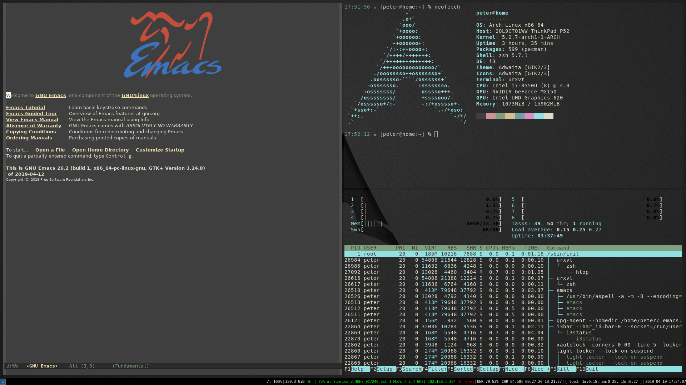

<p align="center"></p>

<h3 align="center">dotfiles</h3>

<div align="center">

  []()
  [](https://github.com/peterzuger/dotfiles/issues)
  [](https://github.com/peterzuger/dotfiles/pulls)
  [](/LICENSE)

</div>

---

<p align="center"> My personal dotfiles.
    <br>
</p>

## 📝 Table of Contents
- [About](#about)
- [Getting Started](#getting_started)
- [Usage](#usage)
- [Built Using](#built_using)
- [Authors](#authors)
- [Acknowledgments](#acknowledgement)


## 🧐 About <a name = "about"></a>
This Repository contains the configuration of all of my computers,
this allows me to quickly and painlessly setup a new machine in under 30 minutes.

For each of my machines there is a make target.

At the moment that is `home`, there is also a `common` target,
that installs all configurations that are common across all my machines.

For headless machines, like servers or raspberrypi's there is also the `headless` target.
The minimal usage of the headless target requires `git`,`stow` and `zsh`, `zsh` must be enabled with `chsh`.

## 🏁 Getting Started <a name = "getting_started"></a>
These instructions will get you a copy of my dotfiles up and running on your local machine.

### CentOS
On CentOS `gnu stow` is not in the default repository's, to install it add the `epel-release` repo.

```
sudo yum install epel-release
sudo yum install stow
```

### Prerequisites
Following Prerequisites must be installed from here: [Arch Packages](https://www.archlinux.org/packages/)

| Prerequisites                                                            | Description                                                                       | [Arch Packages](https://www.archlinux.org/packages/)                                                                                                                                   |
|--------------------------------------------------------------------------|-----------------------------------------------------------------------------------|----------------------------------------------------------------------------------------------------------------------------------------------------------------------------------------|
| [acpi](https://sourceforge.net/projects/acpiclient/files/acpiclient/)    | Client for battery, power, and thermal readings                                   | [acpi](https://www.archlinux.org/packages/community/x86_64/acpi/)                                                                                                                      |
| [alsa](https://www.alsa-project.org/wiki/Main_Page)                      | An alternative implementation of Linux sound support                              | [alsa-utils](https://www.archlinux.org/packages/extra/x86_64/alsa-utils/)                                                                                                              |
| [apparmor](https://gitlab.com/apparmor)                                  | Mandatory Access Control (MAC) using Linux Security Module (LSM)                  | [apparmor](https://www.archlinux.org/packages/extra/x86_64/apparmor/)                                                                                                                  |
| [audit](https://people.redhat.com/sgrubb/audit/)                         | Userspace components of the audit framework                                       | [audit](https://www.archlinux.org/packages/core/x86_64/audit/)                                                                                                                         |
| [base-devel](https://www.archlinux.org/groups/x86_64/base-devel/)        | Developer utilities                                                               | [base-devel](https://www.archlinux.org/groups/x86_64/base-devel/)                                                                                                                      |
| [bc](https://www.gnu.org/software/bc/)                                   | An arbitrary precision calculator language                                        | [bc](https://archlinux.org/packages/extra/x86_64/bc/)                                                                                                                                  |
| [bluez-utils](http://www.bluez.org/)                                     | Development and debugging utilities for the bluetooth protocol stack              | [bluez-util](https://archlinux.org/packages/extra/x86_64/bluez-utils/)                                                                                                                 |
| [bluez](http://www.bluez.org/)                                           | Daemons for the bluetooth protocol stack                                          | [bluez](https://www.archlinux.org/packages/extra/x86_64/bluez/)                                                                                                                        |
| [borg](https://www.borgbackup.org/)                                      | Deduplicating backup program with compression and authenticated encryption        | [borg](https://www.archlinux.org/packages/community/x86_64/borg/)                                                                                                                      |
| [ccache](https://ccache.dev/)                                            | compiler cache                                                                    | [ccache](https://www.archlinux.org/packages/community/x86_64/ccache/)                                                                                                                  |
| [clang](https://clang.llvm.org/)                                         | C language family frontend for LLVM                                               | [clang](https://archlinux.org/packages/extra/x86_64/clang/)                                                                                                                            |
| [cmus](https://cmus.github.io/)                                          | Feature-rich ncurses-based music player                                           | [cmus](https://archlinux.org/packages/community/x86_64/cmus/)                                                                                                                          |
| [dejavu](https://dejavu-fonts.github.io/)                                | Font family based on the Bitstream Vera Fonts with a wider range of characters    | [ttf-dejavu](https://www.archlinux.org/packages/extra/any/ttf-dejavu/)                                                                                                                 |
| [dhcpd](https://roy.marples.name/projects/dhcpcd/)                       | RFC2131 compliant DHCP client daemon                                              | [dhcpcd](https://www.archlinux.org/packages/core/x86_64/dhcpcd/)                                                                                                                       |
| [docker-compose](https://www.docker.com/)                                | Fast, isolated development environments using Docker                              | [docker-compose](https://archlinux.org/packages/community/x86_64/docker-compose/)                                                                                                      |
| [docker](https://www.docker.com/)                                        | Pack, ship and run any application as a lightweight container                     | [docker](https://archlinux.org/packages/community/x86_64/docker/)                                                                                                                      |
| [dunst](https://dunst-project.org/)                                      | Customizable and lightweight notification-daemon                                  | [dunst](https://www.archlinux.org/packages/community/x86_64/dunst/)                                                                                                                    |
| [emacs](https://www.gnu.org/software/emacs/)                             | The extensible, customizable, self-documenting real-time display editor           | [emacs](https://www.archlinux.org/packages/extra/x86_64/emacs/)                                                                                                                        |
| [feh](https://feh.finalrewind.org/)                                      | Fast and light imlib2-based image viewer                                          | [feh](https://www.archlinux.org/packages/extra/x86_64/feh/)                                                                                                                            |
| [firefox](https://www.mozilla.org/en-US/firefox/)                        | Standalone web browser from mozilla.org                                           | [firefox](https://www.archlinux.org/packages/extra/x86_64/firefox/)                                                                                                                    |
| [firejail](https://github.com/netblue30/firejail)                        | Linux namespaces sandbox program                                                  | [firejail](https://www.archlinux.org/packages/community/x86_64/firejail/)                                                                                                              |
| [gdb](https://www.gnu.org/software/gdb/)                                 | The GNU Project Debugger                                                          | [gdb](https://www.archlinux.org/packages/extra/x86_64/gdb/)                                                                                                                            |
| [git](https://git-scm.com/)                                              | the fast distributed version control system                                       | [git](https://www.archlinux.org/packages/extra/x86_64/git/)                                                                                                                            |
| [i3-gaps](https://github.com/Airblader/i3)                               | A fork of i3wm tiling window manager with more features, including gaps           | [i3-gaps](https://www.archlinux.org/packages/community/x86_64/i3-gaps/)                                                                                                                |
| [i3status](https://github.com/i3/i3status)                               | Generates status bar to use with i3bar, dzen2 or xmobar                           | [i3status](https://www.archlinux.org/packages/community/x86_64/i3status/)                                                                                                              |
| [imagemagick](https://www.imagemagick.org/)                              | An image viewing/manipulation program                                             | [imagemagick](https://archlinux.org/packages/extra/x86_64/imagemagick/)                                                                                                                |
| [inetutils](http://www.gnu.org/software/inetutils/)                      | A collection of common network programs                                           | [inetutils](https://www.archlinux.org/packages/core/x86_64/inetutils/)                                                                                                                 |
| [llvm](https://llvm.org/)                                                | Collection of modular and reusable compiler and toolchain technologies            | [llvm](https://archlinux.org/packages/extra/x86_64/llvm/)                                                                                                                              |
| [maim](https://github.com/naelstrof/maim)                                | Utility to take a screenshot using imlib2                                         | [maim](https://www.archlinux.org/packages/community/x86_64/maim/)                                                                                                                      |
| [man](https://www.nongnu.org/man-db/)                                    | A utility for reading man pages                                                   | [man-db](https://archlinux.org/packages/core/x86_64/man-db/)                                                                                                                           |
| [mlocate](https://pagure.io/mlocate)                                     | A utility for finding files by name quickly                                       | [mlocate](https://www.archlinux.org/packages/core/x86_64/mlocate/)                                                                                                                     |
| [mpv](https://mpv.io/)                                                   | a free, open source, and cross-platform media player                              | [mpv](https://archlinux.org/packages/community/x86_64/mpv/)                                                                                                                            |
| [nano](https://www.nano-editor.org/)                                     | Pico editor clone with enhancements                                               | [nano](https://www.archlinux.org/packages/core/x86_64/nano/)                                                                                                                           |
| [neofetch](https://github.com/dylanaraps/neofetch)                       | A CLI system information tool written in BASH that supports displaying images.    | [neofetch](https://archlinux.org/packages/community/any/neofetch/)                                                                                                                     |
| [networkmanager](https://wiki.gnome.org/Projects/NetworkManager)         | Network connection manager and user applications                                  | [networkmanager](https://www.archlinux.org/packages/extra/x86_64/networkmanager/)                                                                                                      |
| [noto-cjk](https://www.google.com/get/noto/)                             | Google Noto CJK fonts                                                             | [noto-fonts-cjk](https://www.archlinux.org/packages/extra/any/noto-fonts-cjk/)                                                                                                         |
| [noto-emoji](https://www.google.com/get/noto/)                           | Google Noto emoji fonts                                                           | [noto-fonts-emoji](https://www.archlinux.org/packages/extra/any/noto-fonts-emoji/)                                                                                                     |
| [noto](https://www.google.com/get/noto/)                                 | Google Noto TTF fonts                                                             | [noto-fonts](https://www.archlinux.org/packages/extra/any/noto-fonts/)                                                                                                                 |
| [openssh](https://www.openssh.com/portable.html)                         | Premier connectivity tool for remote login with the SSH protocol                  | [openssh](https://www.archlinux.org/packages/core/x86_64/openssh/)                                                                                                                     |
| [pass](https://www.passwordstore.org/)                                   | Stores, retrieves, generates, and synchronizes passwords securely                 | [pass](https://archlinux.org/packages/community/any/pass/)                                                                                                                             |
| [picom](https://github.com/yshui/picom)                                  | X compositor that may fix tearing issues                                          | [picom](https://www.archlinux.org/packages/community/x86_64/picom/)                                                                                                                    |
| [pulseaudio-alsa](https://www.freedesktop.org/wiki/Software/PulseAudio/) | A featureful, general-purpose sound server                                        | [pulseaudio-alsa](https://www.archlinux.org/packages/extra/x86_64/pulseaudio-alsa/)                                                                                                    |
| [pv](https://www.ivarch.com/programs/pv.shtml)                           | A terminal-based tool for monitoring the progress of data through a pipeline      | [pv](https://archlinux.org/packages/community/x86_64/pv/)                                                                                                                              |
| [python-pip](https://pip.pypa.io/)                                       | The PyPA recommended tool for installing Python packages                          | [python-pip](https://archlinux.org/packages/extra/any/python-pip/)                                                                                                                     |
| [python-virtualenv](https://virtualenv.pypa.io/)        | Virtual Python Environment builder                                | [python-virtualenv](https://archlinux.org/packages/extra/any/python-virtualenv/) |
| [ranger](http://ranger.github.io/)                                       | Simple, vim-like file manager                                                     | [ranger](https://www.archlinux.org/packages/community/any/ranger/)                                                                                                                     |
| [reflector](https://xyne.archlinux.ca/projects/reflector)                | A Python 3 module and script to retrieve and filter the latest Pacman mirror list | [reflector](https://archlinux.org/packages/community/any/reflector/)                                                                                                                   |
| [rofi-calc](https://github.com/svenstaro/rofi-calc)                      | Do live calculations in rofi!                                                     | [rofi-calc](https://www.archlinux.org/packages/community/x86_64/rofi-calc/)                                                                                                            |
| [rofi](https://github.com/davatorium/rofi)                               | A window switcher, application launcher and dmenu replacement                     | [rofi](https://www.archlinux.org/packages/community/x86_64/rofi/)                                                                                                                      |
| [rsync](https://rsync.samba.org/)                                        | A fast and versatile file copying tool for remote and local files                 | [rsync](https://archlinux.org/packages/extra/x86_64/rsync/)                                                                                                                            |
| [screen](https://www.gnu.org/software/screen/)                           | Full-screen window manager that multiplexes a physical terminal                   | [screen](https://www.archlinux.org/packages/extra/x86_64/screen/)                                                                                                                      |
| [socat](http://www.dest-unreach.org/socat/)                              | Multipurpose relay                                                                | [socat](https://archlinux.org/packages/extra/x86_64/socat/)                                                                                                                            |
| [sshfs](https://github.com/libfuse/sshfs)                                | FUSE client based on the SSH File Transfer Protocol                               | [sshfs](https://archlinux.org/packages/community/x86_64/sshfs/)                                                                                                                        |
| [stow](https://www.gnu.org/software/stow/)                               | Manage installation of multiple softwares in the same directory tree              | [stow](https://www.archlinux.org/packages/community/any/stow/)                                                                                                                         |
| [texinfo](https://www.gnu.org/software/texinfo/)                         | GNU documentation system for on-line information and printed output               | [texinfo](https://archlinux.org/packages/core/x86_64/texinfo/)                                                                                                                         |
| [tlp](https://linrunner.de/en/tlp/tlp.html)                              | Linux Advanced Power Management                                                   | [tlp](https://archlinux.org/packages/community/any/tlp/)                                                                                                                               |
| [torbrowser-launcher](github.com/micahflee/torbrowser-launcher)          | Securely and easily download, verify, install, and launch Tor Browser in Linux    | [torbrowser-launcher](https://www.archlinux.org/packages/community/any/torbrowser-launcher/)                                                                                           |
| [torsocks](https://gitweb.torproject.org/torsocks.git/)                  | Wrapper to safely torify applications                                             | [torsocks](https://www.archlinux.org/packages/community/x86_64/torsocks/)                                                                                                              |
| [udiskie](https://github.com/coldfix/udiskie)                            | Removable disk automounter using udisks                                           | [udiskie](https://www.archlinux.org/packages/community/any/udiskie/)                                                                                                                   |
| [urxvt](http://software.schmorp.de/pkg/rxvt-unicode.html)                | Unicode enabled rxvt-clone terminal emulator (urxvt)                              | [rxvt-unicode](https://www.archlinux.org/packages/community/x86_64/rxvt-unicode/), [rxvt-unicode-terminfo](https://www.archlinux.org/packages/community/x86_64/rxvt-unicode-terminfo/) |
| [w3m](http://w3m.sourceforge.net/)                                       | text-based web browser                                                            | [w3m](https://www.archlinux.org/packages/extra/x86_64/w3m/)                                                                                                                            |
| [wireguard](https://www.wireguard.com/)                                  | next generation secure network tunnel - tools for configuration                   | [wireguard-tools](https://www.archlinux.org/packages/extra/x86_64/wireguard-tools/)                                                                                                    |
| [xautolock](http://ibiblio.org/pub/Linux/X11/screensavers/)              | An automatic X screen-locker/screen-saver                                         | [xautolock](https://www.archlinux.org/packages/community/x86_64/xautolock/)                                                                                                            |
| [xbacklight](https://xorg.freedesktop.org/wiki/)                         | RandR-based backlight control application                                         | [xorg-xbacklight](https://www.archlinux.org/packages/extra/x86_64/xorg-xbacklight/)                                                                                                    |
| [xclip](https://github.com/astrand/xclip)                                | Command line interface to the X11 clipboard                                       | [xclip](https://www.archlinux.org/packages/extra/x86_64/xclip/)                                                                                                                        |
| [xdotool](https://www.semicomplete.com/projects/xdotool/)                | Command-line X11 automation tool                                                  | [xdotool](https://www.archlinux.org/packages/community/x86_64/xdotool/)                                                                                                                |
| [xorg-server](https://www.x.org/wiki/)                                   | Xorg X server                                                                     | [xorg-server](https://www.archlinux.org/packages/extra/x86_64/xorg-server/)                                                                                                            |
| [xorg-xauth](https://xorg.freedesktop.org/)                              | X.Org authorization settings program                                              | [xorg-xauth](https://www.archlinux.org/packages/extra/x86_64/xorg-xauth/)                                                                                                              |
| [xorg-xdm](https://xorg.freedesktop.org/)                                | X Display Manager                                                                 | [xorg-xdm](https://www.archlinux.org/packages/extra/x86_64/xorg-xdm/)                                                                                                                  |
| [zsh-completions](https://github.com/zsh-users/zsh-completions)          | Additional completion definitions for Zsh                                         | [zsh-completions](https://archlinux.org/packages/community/any/zsh-completions/)                                                                                                       |
| [zsh](http://www.zsh.org/)                                               | A very advanced and programmable command interpreter (shell) for UNIX             | [zsh](https://www.archlinux.org/packages/extra/x86_64/zsh/)                                                                                                                            |

Following Prerequisites are for my emacs configuration;

| Prerequisites                                           | Description                                                       | [Arch Packages](https://www.archlinux.org/packages/)                             |
|---------------------------------------------------------|-------------------------------------------------------------------|----------------------------------------------------------------------------------|
| [aspell](http://aspell.net/)                            | A spell checker designed to eventually replace Ispell             | [aspell](https://archlinux.org/packages/extra/x86_64/aspell/)                    |
| [aspell-de](https://j3e.de/ispell/igerman98/index.html) | German dictionary for aspell                                      | [aspell-de](https://archlinux.org/packages/extra/x86_64/aspell-de/)              |
| [aspell-en](http://aspell.net/)                         | English dictionary for aspell                                     | [aspell-en](https://archlinux.org/packages/extra/x86_64/aspell-en/)              |
| [cmake](https://www.cmake.org/)                         | A cross-platform open-source make system                          | [cmake](https://archlinux.org/packages/extra/x86_64/cmake/)                      |
| [ctags](http://ctags.sourceforge.net/)                  | Generates an index file of language objects found in source files | [ctags](https://www.archlinux.org/packages/extra/x86_64/ctags/)                  |
| [global](https://www.gnu.org/software/global/)          | Source code tag system                                            | [global](https://archlinux.org/packages/community/x86_64/global/)                |
| [go](https://golang.org/)                               | Core compiler tools for the Go programming language               | [go](https://archlinux.org/packages/community/x86_64/go/)                        |
| [llvm-libs](https://llvm.org/)                          | LLVM runtime libraries                                            | [llvm-libs](https://archlinux.org/packages/extra/x86_64/llvm-libs/)              |
| [mypy](http://www.mypy-lang.org/)                       | Optional static typing for Python 2 and 3 (PEP484)                | [mypy](https://archlinux.org/packages/community/any/mypy/)                       |
| [offlineimap](http://offlineimap.org/)                  | Synchronizes emails between two repositories                      | [offlineimap](https://archlinux.org/packages/community/any/offlineimap/)         |
| [python-black](https://github.com/psf/black)            | Uncompromising Python code formatter                              | [python-black](https://archlinux.org/packages/community/any/python-black/)       |
| [python-pylint](https://pylint.org)                     | Analyzes Python code looking for bugs and signs of poor quality   | [python-pylint](https://archlinux.org/packages/extra/any/python-pylint/)         |
| [texlive](http://tug.org/texlive/)                      | TeX Live core distribution                                        | [texlive](https://archlinux.org/packages/extra/any/texlive-core/)                |

Following Prerequisites might need to be changed depending on your hardware configuration:

| Prerequisites                                          | Description                                                 | [Arch Packages](https://www.archlinux.org/packages/)                                  |
|--------------------------------------------------------|-------------------------------------------------------------|---------------------------------------------------------------------------------------|
| [efibootmgr](https://github.com/rhboot/efibootmgr)     | Linux user-space application to modify the EFI Boot Manager | [efibootmgr](https://archlinux.org/packages/core/x86_64/efibootmgr/)                  |
| [intel-ucode](https://github.com/intel/)               | Microcode update files for Intel CPUs                       | [intel-ucode](https://archlinux.org/packages/extra/any/intel-ucode/)                  |
| [xf86-video-intel](https://01.org/linuxgraphics)       | X.org Intel i810/i830/i915/945G/G965+ video drivers         | [xf86-video-intel](https://www.archlinux.org/packages/extra/x86_64/xf86-video-intel/) |
| [xf86-video-nouveau](https://nouveau.freedesktop.org/) | Open Source 3D acceleration driver for nVidia cards         | [xf86-nouveau](https://www.archlinux.org/packages/extra/x86_64/xf86-video-nouveau/)   |


For virtualbox use these packages:

| Prerequisites                                                | Description                                     | [Arch Packages](https://www.archlinux.org/packages/)                                                                |
|--------------------------------------------------------------|-------------------------------------------------|---------------------------------------------------------------------------------------------------------------------|
| [virtualbox-guest-modules-arch](https://www.virtualbox.org/) | Virtualbox guest kernel modules for Arch Kernel | [virtualbox-guest-modules-arch](https://www.archlinux.org/packages/community/x86_64/virtualbox-guest-modules-arch/) |
| [virtualbox-guest-utils](https://www.virtualbox.org/)        | VirtualBox Guest userspace utilities            | [virtualbox-guest-utils](https://www.archlinux.org/packages/community/x86_64/virtualbox-guest-utils/)               |
| [xf86-video-vmware](https://xorg.freedesktop.org/wiki/)      | X.org vmware video driver                       | [xf86-video-vmware](https://www.archlinux.org/packages/extra/x86_64/xf86-video-vmware/)                             |


Following Prerequisites must be taken from the [AUR](https://aur.archlinux.org/packages/):

| Prerequisites                              | Description                                                           | [AUR](https://aur.archlinux.org/packages/) Packages                  |
|--------------------------------------------|-----------------------------------------------------------------------|----------------------------------------------------------------------|
| [i3lock](https://github.com/i3/i3lock)     | improved screen locker                                                | [i3lock-color](https://aur.archlinux.org/packages/i3lock-color/)     |
| [mu](http://www.djcbsoftware.nl/code/mu)   | Maildir indexer/searcher and Emacs client (mu4e)                      | [mu](https://aur.archlinux.org/packages/mu/)                         |
| [peda-git](https://github.com/longld/peda) | Python Exploit Development Assistance for GDB                         | [peda-git (AUR)](https://aur.archlinux.org/packages/peda-git/)       |
| [symbola](http://users.teilar.gr/~g1951d/) | Font for unicode symbols (part of Unicode Fonts for Ancient Scripts). | [ttf-symbola (AUR)](https://aur.archlinux.org/packages/ttf-symbola/) |

### Optional Prerequisites
Following packages might be installed for convenience:

| Prerequisites                                      | Description                                                                               | [Arch Packages](https://www.archlinux.org/packages/)                 |
|----------------------------------------------------|-------------------------------------------------------------------------------------------|----------------------------------------------------------------------|
| [7z](http://p7zip.sourceforge.net/)                | p7zip is a port of 7za.exe for POSIX systems                                              | [p7zip](https://www.archlinux.org/packages/extra/x86_64/p7zip/)      |
| [bzip2](http://www.sourceware.org/bzip2/)          | bzip2 is a freely available, patent free (see below), high-quality data compressor.       | [bzip2](https://www.archlinux.org/packages/core/x86_64/bzip2/)       |
| [gzip](https://www.gnu.org/software/gzip/)         | GNU Gzip is a popular data compression program                                            | [gzip](https://www.archlinux.org/packages/core/x86_64/gzip/)         |
| [lzma](https://tukaani.org/xz/)                    | XZ Utils is free general-purpose data compression software with a high compression ratio. | [xz](https://www.archlinux.org/packages/core/x86_64/xz/)             |
| [lzop](https://www.lzop.org/)                      | lzop is a file compressor which is very similar to gzip.                                  | [lzop](https://www.archlinux.org/packages/extra/x86_64/lzop/)        |
| [perl-libwww](https://github.com/libwww-perl)      | The World-Wide Web library for Perl                                                       | [perl-libwww](https://archlinux.org/packages/extra/any/perl-libwww/) |
| [rar](https://www.rarlab.com/)                     | powerful archive manager                                                                  | [rar](https://aur.archlinux.org/packages/rar/)                       |
| [tar](https://www.gnu.org/software/tar/)           | create tar archives                                                                       | [tar](https://www.archlinux.org/packages/core/x86_64/tar/)           |
| [unzip](http://infozip.sourceforge.net/UnZip.html) | UnZip is an extraction utility for archives compressed in .zip format                     | [unzip](https://www.archlinux.org/packages/extra/x86_64/unzip/)      |
| [xz](https://tukaani.org/xz/)                      | XZ Utils is free general-purpose data compression software with a high compression ratio. | [xz](https://www.archlinux.org/packages/core/x86_64/xz/)             |
| [zip](http://infozip.sourceforge.net/Zip.html)     | compression and file packaging/archive utility                                            | [zip](https://www.archlinux.org/packages/extra/x86_64/zip/)          |

Install `perl-libwww` like this:

```
sudo pacman -S perl-libwww --asdeps git
```

### Automatic Prerequisites
Following things are installed automatically, via git submodules.

| Prerequisites                                          | Description                                                         |
|--------------------------------------------------------|---------------------------------------------------------------------|
| [liquidprompt](https://github.com/nojhan/liquidprompt) | A full-featured & carefully designed adaptive prompt for Bash & Zsh |
| [ssh-connect](https://github.com/gko/ssh-connect)      | simple ssh manager based on bash/zsh history                        |


### Installing
Before installing the dotfiles, a few things have to be setup manualy.

Create a a user:
```
useradd -m -G wheel uucp peter
```

When using docker, wireshark or thor, add the user to the docker,
wireshark and tor groups respectively.


For connecting with the internet I use dhcpcd and nmtui(networkmanager).
```
sudo systemctl enable dhcpcd.service
sudo systemctl enable NetworkManager.service
```

When using xdm, the xdm service has to be activated.
If you are already using a Display Manager, this should not be done.
```
sudo systemctl enable xdm.service
```

To install these dotfiles, just clone the repo, it does not need to
be in any special folder, just put it where you like.
The `--recursive` is __required__, otherwise the sub-repository's wont be downloaded.
```
git clone --recursive https://gitlab.com/peterzuger/dotfiles.git
cd dotfiles
```

now that you have all the sources, just `make home`!
```
make home
```

make will deploy all dotfiles with [stow](https://www.gnu.org/software/stow/).
This tool just creates symbolic links for all files, it will not override
any files when doing so and just fails if it can't create a link.

Once the files are deployed, the grub config can be regenerated,
for this you must first place the [breeze](https://github.com/gustawho/grub2-theme-breeze)
grub theme in `/boot/grub/themes/breeze`.

Then you can regenerate the grub config: (using the correct path if this is not correct)
```
sudo grub-mkconfig -o /boot/grub/grub.cfg
```

There are still a few services that can be enabled to provide some additional functionality:
To enable them all use:
```
systemctl --user enable dunst.service picom.service udiskie.service xautolock.service
```

### Uninstalling
To unstow the dotfiles.
```
make home-uninstall
```

This will not delete any files, it will just remove the symlinks.


## 🎈 Usage <a name="usage"></a>



### Global Keybindings
The i3 config configures the "Windows" key as the modifier key.

- mod + L             - lock the screen __now__
- mod + d             - rofi
- Print               - screenshot of all monitors
- mod + Print         - screenshot of the active window
- mod + Shift + Print - screenshot of an area (interactive)
- mod + RET           - open urxvt


## ⛏️ Built Using <a name = "built_using"></a>
- [stow](https://www.gnu.org/software/stow/) - symbolic link farmer


## ✍️ Authors <a name = "authors"></a>
- [@peterzuger](https://github.com/peterzuger)


## 🎉 Acknowledgements <a name = "acknowledgement"></a>
- [Arch Wiki Dotfiles](https://wiki.archlinux.org/index.php/Dotfiles)
- [GitHub does dotfiles](https://dotfiles.github.io/)
- [@kylelobo](https://github.com/kylelobo) - Documentation template
